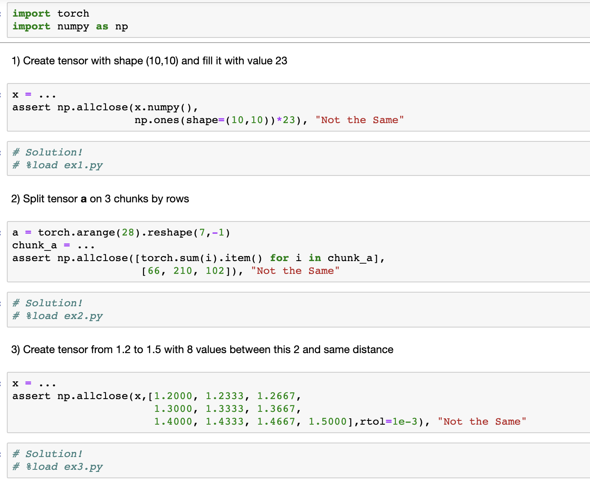

# PyTorchChallenge
PyTorch challenge is 30 exercises (10 Tasks).
It usually takes less then 15 minutes a day, so you need 10 days for full Challenge. 

For answers, you need to uncomment the corresponding line in notebook.
(Try to solve yourself please!)

